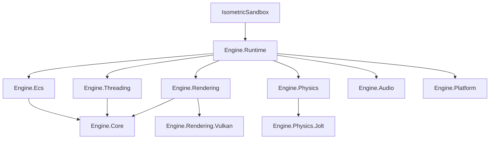

# Architecture

The dependency direction is downward: sample -> runtime -> subsystems -> core. Backend-specific projects implement narrow interfaces and never leak backend handles into gameplay code.

