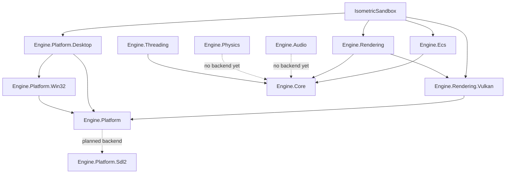

# Architecture

The dependency direction is downward: sample -> contracts -> backends -> core. The sample composes the modules directly as the executable vertical slice; a formal `Engine.Runtime` composition layer is planned. Backend-specific projects implement narrow interfaces and never leak backend handles into gameplay code.

Planned (not yet projects): `Engine.Platform.Sdl2` (Linux/macOS windowing), audio and physics adapters, and a formal `Engine.Runtime` composition layer.
